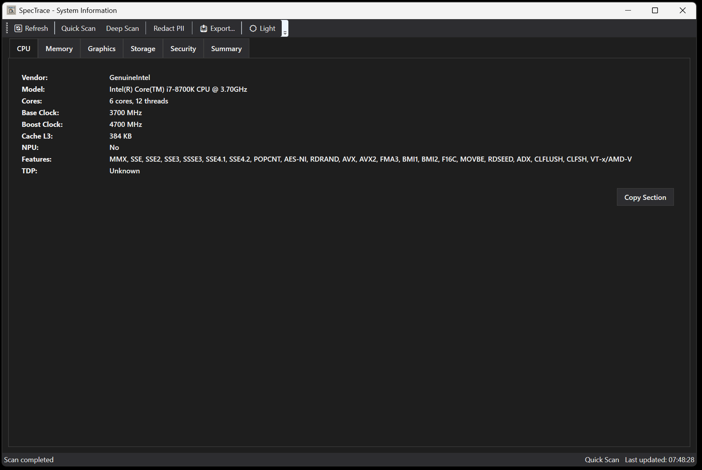

# SpecTrace - System Information Tool

**A comprehensive Windows system information tool designed for professionals, enthusiasts and support teams**

[Download Now](#download) • [Features](#features) • [Screenshots](#screenshots) • [Support](#support)

## 🚀 Quick Start

1. **Download** the latest release from the [Releases page](https://github.com/jhew/SpecTrace/releases/latest)
2. **Run** `SpecTrace.exe` - no installation required!
3. **View** comprehensive system information instantly
4. **Export** reports for tech support or documentation

> **No administrator privileges required** for basic scanning

## ✨ Features

### 🔍 **Comprehensive Hardware Detection**
- **CPU**: Detailed processor information including cores, cache, features, and NPU detection
- **Memory**: RAM modules, timings, XMP profiles, and performance metrics
- **Graphics**: GPU details, drivers, DirectX capabilities, and PCIe configuration
- **Storage**: NVMe/SATA drives with SMART health monitoring and BitLocker status
- **Network**: Wi-Fi standards, Bluetooth, speeds, and connectivity information
- **Security**: TPM status, Secure Boot, VBS/HVCI, and Credential Guard

### 🎨 **Modern Interface**
- Clean, professional tabbed interface
- Light and dark theme support
- Real-time hardware monitoring
- Intuitive navigation and search

### 📊 **Export & Sharing**
- **JSON**: Machine-readable format for automation
- **XML**: Structured data for enterprise integration
- **Text**: Simple, readable format for documentation
- **Multiple Categories**: Export all data or specific categories

### 🔒 **Privacy & Security**
- **No telemetry** - all data stays on your computer
- **PII redaction** - Hide serial numbers, MAC addresses, and personal info
- **Read-only** - Never modifies your system
- **Portable** - No installation or registry changes

### ⚡ **Performance**
- **Fast Scanning**: Complete system overview in under 30 seconds
- **Lightweight**: Minimal resource usage and memory footprint
- **Reliable**: Built-in timeout protection and error handling

## 💻 System Requirements

- **Windows 10** (version 1903 or later) or **Windows 11**
- **4 GB RAM** minimum (8 GB recommended)
- **10 MB** free disk space
- **.NET 8.0 Runtime** (automatically installed on newer Windows versions)
- **Standard user permissions** (Administrator not required for basic functionality)

## 📸 Screenshots

### Main Interface

*SpecTrace provides a clean, intuitive interface for exploring your system specifications with organized tabs and detailed information.*

## 💾 Download

### Latest Release
Download the latest version from our [Releases page](https://github.com/jhew/SpecTrace/releases/latest)

**System Requirements:**
- Windows 10 version 1909 or newer / Windows 11
- .NET 8.0 Runtime (included in download)
- No administrator privileges required for basic functionality

### Quick Download Links
- [📥 SpecTrace.exe](https://github.com/jhew/SpecTrace/releases/latest/download/SpecTrace.exe) - Single-file executable
- [📦 Full Package](https://github.com/jhew/SpecTrace/releases/latest) - All formats and documentation

## 🎯 Use Cases

### **IT Professionals**
- Quick system audits and documentation
- Hardware compatibility verification
- Performance troubleshooting
- Asset management and inventory

### **Tech Support**
- Customer system diagnostics
- Forum-ready system information sharing
- Hardware failure investigation
- Driver and firmware verification

### **Enthusiasts & Gamers**
- System monitoring and optimization
- Hardware upgrade planning
- Overclocking verification
- Performance benchmarking preparation

### **Organizations**
- Fleet management and auditing
- Compliance reporting
- Security posture assessment
- Procurement planning

## 🔧 Usage

### Quick Start
1. Download `SpecTrace.exe` from the [latest release](../../releases/latest)
2. Run the executable - no installation required!
3. Wait for the automatic system scan to complete
4. Explore your system information using the tabs
5. Export your data using the Export button

### Key Features
- **Instant Overview**: System specs displayed immediately upon launch
- **Multiple Categories**: Organized tabs for CPU, Memory, Storage, Graphics, and more
- **Privacy Protection**: Built-in PII redaction keeps your data safe
- **Multiple Export Formats**: Save as TXT, JSON, or XML for different uses
- **Portable**: Run from anywhere without installation

### Need Help?
- 📖 **[Complete User Guide](docs/USER_GUIDE.md)** - Detailed usage instructions
- ❓ **[Frequently Asked Questions](docs/FAQ.md)** - Common questions answered
- 🛠️ **[Troubleshooting Guide](docs/TROUBLESHOOTING.md)** - Solve common issues

Available options:
- `--quick` / `--deep` - Scan mode selection
- `--redact` - Hide personally identifiable information
- `--json <file>` - Export to JSON format
- `--html <file>` - Export to HTML format
- `--markdown <file>` - Export to Markdown format
- `--text <file>` - Export to plain text format

## 🆘 Support

### Getting Help
- **Issues**: Report bugs on our [GitHub Issues](https://github.com/jhew/SpecTrace/issues) page
- **Discussions**: Join conversations in [GitHub Discussions](https://github.com/jhew/SpecTrace/discussions)
- **Documentation**: Check our [Wiki](https://github.com/jhew/SpecTrace/wiki) for detailed guides

### Known Limitations
- Some advanced hardware features require administrator privileges
- Vendor-specific hardware details may need proprietary SDKs
- SMART data availability depends on drive and driver support

## 🤝 Contributing

While SpecTrace is primarily designed for end-users, we welcome contributions from the community:

- **Bug Reports**: Help us improve by reporting issues
- **Feature Requests**: Suggest new functionality
- **Code Contributions**: Submit pull requests for enhancements
- **Documentation**: Help improve our guides and documentation

See [CONTRIBUTING.md](CONTRIBUTING.md) for detailed guidelines.

## 📜 License

SpecTrace is released under the [MIT License](LICENSE). Free for personal and commercial use.

## 🔒 Privacy

SpecTrace respects your privacy:
- **No data collection** - All information stays on your device
- **No internet connections** - Works completely offline
- **Optional PII redaction** - Hide sensitive information when sharing reports
- **Open source** - Verify what the software does

---

**Made with ❤️ for the Windows community**

[⬆ Back to Top](#spectrace---professional-system-information-tool)

