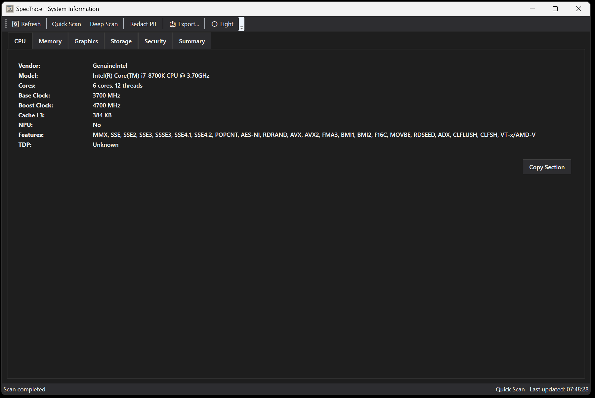

# SpecTrace

<div align="center">

**A Windows system information tool for professionals, enthusiasts, and support teams.**

[](https://github.com/jhew/SpecTrace/releases/latest)
[](https://github.com/jhew/SpecTrace/releases/latest)
[](https://dotnet.microsoft.com/download/dotnet/8.0)

[Download](https://github.com/jhew/SpecTrace/releases/latest)  [Screenshots](#screenshots)  [CLI Reference](#cli-reference)  [Support](#support)

</div>

## Overview

SpecTrace is a portable, single-executable tool that collects detailed hardware and software information from a Windows system. It requires no installation, makes no changes to the system, and operates entirely offline.

## Features

**Hardware detection**
- CPU: vendor, model, core configuration (P/E), clocks, cache, flags, NPU
- Motherboard: manufacturer, model, BIOS version and date
- Memory: total capacity, channels, speed, timings, XMP/EXPO profile, per-DIMM detail
- Graphics: GPU name, driver version, PCIe slot, DirectX feature level, DXR, DirectStorage
- Monitors: make, model, physical size, native resolution, refresh rate, connection type, HDR/VRR, year of manufacture
- Storage: NVMe and SATA drives with SMART health, temperature, power-on hours, BitLocker status
- Network: adapter details, Wi-Fi standards, Bluetooth
- Security: TPM, Secure Boot, VBS, HVCI, Credential Guard

**Interface**
- Tabbed layout with dedicated sections per hardware category
- Light and dark theme with matching title bar
- Per-section clipboard copy
- Forum-ready system summary

**Export formats**
- JSON, HTML, Markdown, plain text
- PII redaction (serial numbers, MAC addresses, hostnames) for safe sharing

## Requirements

- Windows 10 version 1903 or later, or Windows 11
- .NET 8.0 Runtime
- Standard user account (administrator not required for basic scan)

## Getting Started

1. Download `SpecTrace.exe` from the [Releases page](https://github.com/jhew/SpecTrace/releases/latest).
2. Run the executable. No installation required.
3. A quick scan runs automatically on launch.
4. Use **Deep Scan** for additional data such as SMART attributes and power metrics.

## CLI Reference

```
SpecTrace.exe [options]
```

| Option | Description |
| --- | --- |
| `--quick` | Quick scan (default) |
| `--deep` | Deep scan  includes SMART, power metrics |
| `--redact` | Redact personally identifiable information |
| `--json <file>` | Export to JSON |
| `--html <file>` | Export to HTML |
| `--markdown <file>` | Export to Markdown |
| `--text <file>` | Export to plain text |

## Screenshots



## For IT Teams

SpecTrace is designed to fit into existing support and audit workflows:

- Single portable EXE suitable for USB kits and remote sessions
- CLI export to JSON or Markdown for scripted asset collection
- PII redaction for safe log sharing and ticketing
- No telemetry, no installer, no registry changes
- Runs on aging hardware with minimal resource overhead

| Capability | SpecTrace | CPU-Z | Speccy |
| --- | --- | --- | --- |
| Portable, no install | Yes | Partial | Partial |
| No telemetry | Yes | Varies | Varies |
| CLI export (JSON / MD / HTML) | Yes | No | No |
| PII redaction | Yes | No | No |

## Privacy

SpecTrace collects no data, makes no network connections, and does not transmit information of any kind. All output stays on the local machine. Source code is available for review.

See [PRIVACY.md](PRIVACY.md) for the full privacy statement.

## Contributing

Bug reports, feature requests, and pull requests are welcome. See [CONTRIBUTING.md](CONTRIBUTING.md) for guidelines.

## License

Released under the [MIT License](LICENSE).
